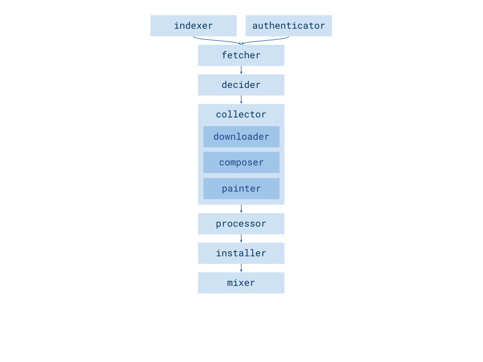

# Design

Spotitube is made of a pool of routines which carry out their job independently and in parallel.
Each single one of these routines, will possibly receive a work mandate from a fellow routine, process that work unit and pass the ball.

It's an assembly line, where every single step has a very constrained work to do and a dedicated queue for items to accomplish that work for.
Such queues usually carry a specific track (be it part of synchronization of user's library, of an album, a playlist, or a single track), but sometimes they only represent a semaphore or other types such as playlists.

The assembly line is made of the following routines:

## Indexer

Scans the music folder in order to parse all the assets that have been synchronized using Spotitube.
It is achieved by reading a specific custom ID3 metadata field corresponding to the Spotify track ID (which, in turn, is stuck into the MP3 file at processing time).

This is done to ensure that tracks collisions are properly handled and that already downloaded songs are skipped.

## Authenticator

Self-explainatory: handles Spotify authentication.

## Fetcher

Once Indexer and Authenticator succeed, they signal their status to the Fetcher, using a semaphor-like queue (of length of one and of boolean type).

The fetcher, then, goes through any given arg (be it the library, a playlist, an album, or a single track) and handles the fetching of data for each track composing the given collection, all from Spotify APIs.

That data is then parsed into a custom Track object which is passed to the Decider queue.

## Decider

For each Track passed over by the Fetcher, it queries every provider defined (currently YouTube and Qobuz), looking for a result that best matches the given track data.

## Collector

This component is split in three parts:

1. Downloader: downloads the result which the Decider picked for the given track.
2. Composer: queries every lyrics provider defined (currently Genius and LRCLIB) and — if found — downloads it, preferring synced LRC over plain text when available.
3. Painter: downloads the artwork from the URL which was given by Spotify APIs.

## Processor

The Processor applies further customization to the asset, such as normalizing the loudness of the track file to -14 LUFS (via `ffmpeg`'s `loudnorm`, Spotify reference) or encoding all the metadata collected as ID3 (MP3) metadata.

## Installer

Moves the file into its final location.

## Mixer

For each playlist passed for synchronization, bundles it into an M3U (default) or PLS file (selectable via `--playlist-encoding`) containing every track of the playlist that has been successfully installed.

## Daemon mode

The `daemon` subcommand executes the sync pipeline described above in a loop via an
outer driver (`runDaemon`), instead of running once and exiting. The loop sits _outside_ the
pipeline on purpose: each cycle recreates the semaphores and queues and runs the exact
same close-based shutdown as a one-shot invocation, so no pipeline stage needs to know
about daemon mode.

- **Index**: built once by the Indexer on the first cycle, then maintained incrementally —
  the Decider marks claimed tracks `Online`, the Installer marks them `Installed`.
  At the end of every cycle, entries still `Online` (claimed but never installed, e.g.
  after a failed or aborted cycle) are dropped via `index.ResetPending()`, so the next
  cycle retries them instead of skipping them forever.
- **Authenticator**: runs once on the first cycle. Later cycles only validate the session
  with a lightweight `CurrentUser` call: a dead refresh token (`invalid_grant`) is fatal
  and stops the daemon, transient failures just skip the cycle. The rotated session is
  persisted to disk after every cycle to capture refresh token rotation.
- **Scheduling**: cycles are strictly sequential — the next cycle starts only after the
  previous one finished, followed by `--interval` of idle time. There is intentionally
  no overlapping and no fixed ticker.
- **Shutdown**: `SIGINT`/`SIGTERM` cancel the cycle context; the Fetcher checks for
  cancellation between its sequential phases, the queue-closing defers trigger the usual
  cascade shutdown, and the loop exits instead of sleeping again.
