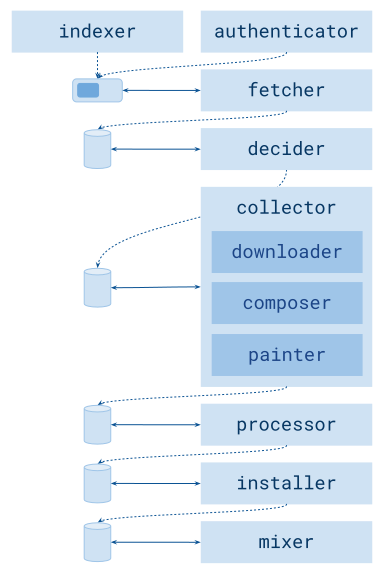

# Design

Spotitube is made of a pool of routines which carry out their job independently and in parallel.
Each single one of these routines, will possibly receive a work mandate from a fellow routine, process that work unit and pass the ball.

It's an assembly line, where every single step has a very constrained work to do and a dedicated queue for items to accomplish that work for.
Such queues usually carry a specific track (be it part of synchronization of user's library, of an album, a playlist, or a single track), but sometimes they only represent a semaphore or other types such as playlists.

The assembly line is made of the following routines:

## Indexer

Scans the music folder in order to parse all the assets that have been synchronized using Spotitube.
It is achieved by reading a specific custom ID3 metadata field corresponding to the Spotify track ID (which, in turn, is stuck into the MP3 file at processing time).

This is done to ensure that tracks collisions are properly handled and that already downloaded songs are skipped.

## Authenticator

Self-explainatory: handles Spotify authentication.

## Fetcher

Once Indexer and Authenticator succeed, they signal their status to the Fetcher, using a semaphor-like queue (of length of one and of boolean type).

The fetcher, then, goes through any given arg (be it the library, a playlist, an album, or a single track) and handles the fetching of data for each track composing the given collection, all from Spotify APIs.

That data is then parsed into a custom Track object which is passed to the Decider queue.

## Decider

For each Track passed over by the Fetcher, it queries every provider defined (e.g. YouTube), looking for a result that best matches the given track data.

## Collector

This component is split in three parts:

1. Downloader: downloads the result which the Decider picked for the given track.
2. Composer: queries every lyrics provider defined (e.g. Genius) and — if found — downloads it.
3. Painter: downloads the artwork from the URL which was given by Spotify APIs.

## Processor

The Processor applies further customization to the asset, such as rebalancing the volume of the track file or encoding all the metadata collected as ID3 (MP3) metadata.

## Installer

Moves the file into its final location.

## Mixer

For each playlist passed for synchronization, bundles it into a PLS (or whatever other encoding is used, e.g. M3U) file which contains every track composing the playlist which has been successfully installed.
